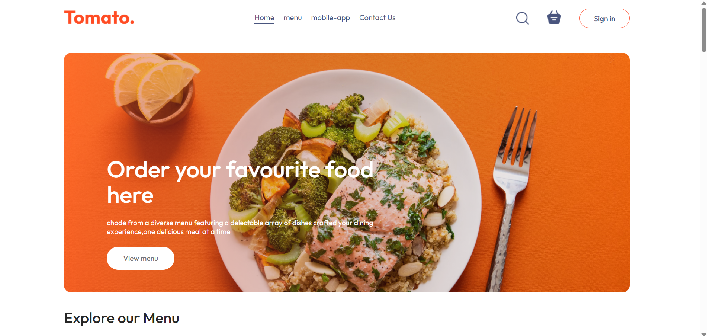
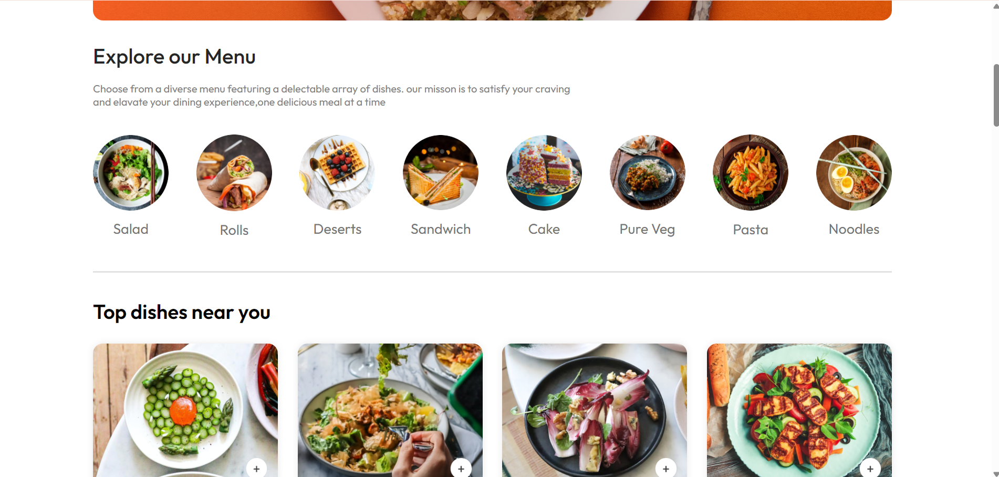
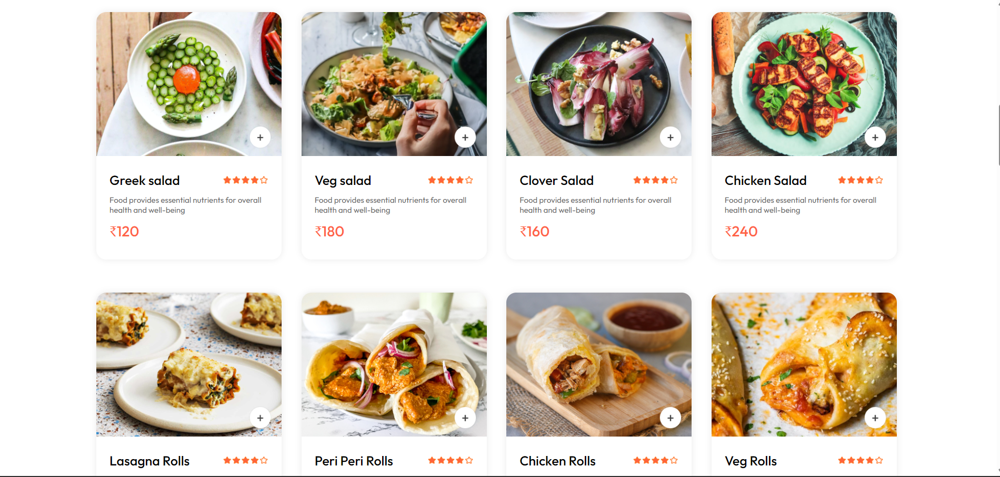
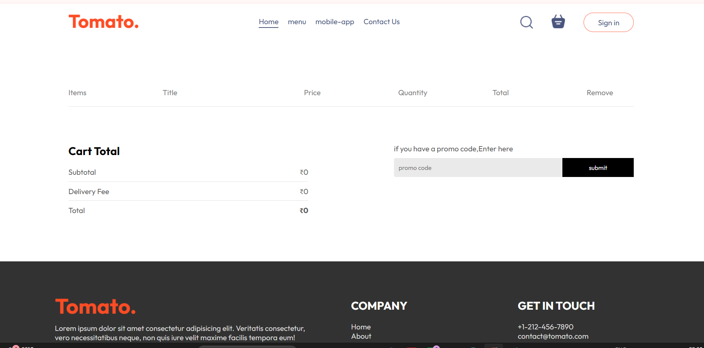
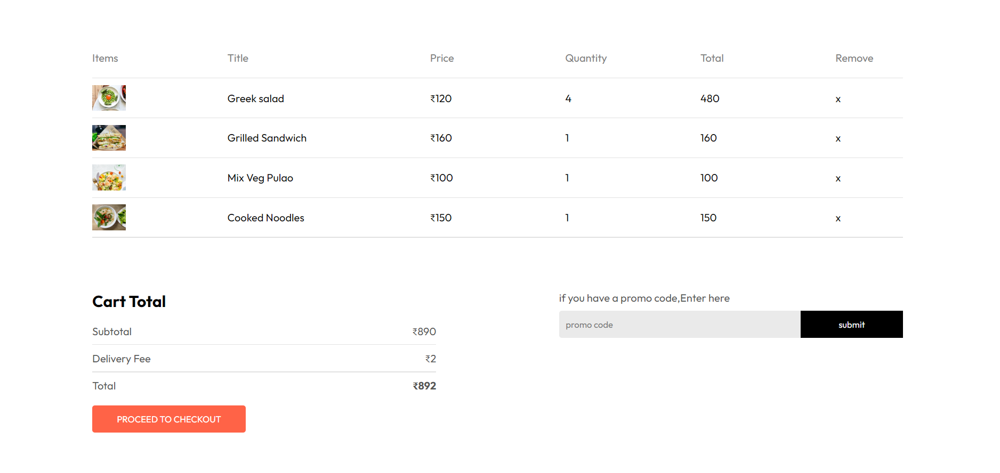
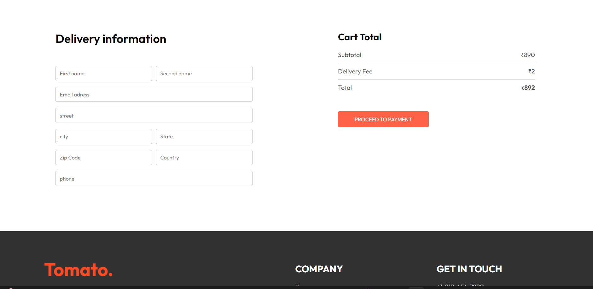

# 🍔 Food Delivery App

A modern and responsive **Food Delivery Web Application** built with **React.js**. The application provides a smooth food browsing and ordering experience with category-based food exploration, cart management, checkout UI, and responsive design.

## 🚀 Live Demo

🔗 **Live Website:** https://food-delivery-app-4ma9.vercel.app/

## 📂 GitHub Repository

🔗 **Source Code:** https://github.com/dibyendudp12-coder/Food-Delivery-App

---

## ✨ Features

- 🏠 Responsive Home Page
- 🍕 Explore food by category
- 🍽️ Browse food items
- 🛒 Add food items to cart
- ➕ Increase item quantity
- ➖ Decrease item quantity
- 🗑️ Remove items from cart
- 💰 Dynamic cart total calculation
- 🔐 Login / Sign Up popup UI
- 📦 Checkout / Place Order page
- 📱 Responsive user interface
- 🔄 Global state management using React Context API
- ⚡ Fast development setup with Vite

---

## 🛠️ Tech Stack

### Frontend
- **React.js**
- **JavaScript (ES6+)**
- **HTML5**
- **CSS3**
- **React Router**
- **React Context API**
- **Vite**

### Deployment
- **Vercel**

### Development Tools
- **VS Code**
- **Git**
- **GitHub**

---

## 📸 Screenshots

### 🏠 Home Page


### 🍕 Menu & Food Categories


### 🍽️ Food Items


### 🛒 Empty Cart


### 🛍️ Cart With Items


### 📦 Checkout / Delivery Information


---

## 🧠 React Concepts Used

- Functional Components
- Props
- `useState`
- `useContext`
- Context API
- React Router
- Event Handling
- Conditional Rendering
- Component Reusability
- State Management
- Dynamic Rendering
- Responsive UI Development

---

## 🛒 Cart Functionality

Users can:

1. Add food items to the cart.
2. Increase or decrease item quantity.
3. Remove food items.
4. View selected items.
5. Calculate the total cart amount dynamically.
6. Proceed to checkout.

The cart state is managed using **React Context API**.

---

## 📱 Responsive Design

The application is designed for:

- 💻 Desktop
- 💻 Laptop
- 📱 Mobile
- 📟 Tablet

---

## ⚙️ Installation & Setup

### 1. Clone the repository

```bash
git clone https://github.com/dibyendudp12-coder/Food-Delivery-App.git
```

### 2. Navigate to the project directory

```bash
cd Food-Delivery-App
```

### 3. Install dependencies

```bash
npm install
```

### 4. Start the development server

```bash
npm run dev
```

Then open the local URL shown in the terminal, usually:

```text
http://localhost:5173
```

---

## 🔮 Future Improvements

The current version focuses on the frontend experience. Planned improvements include:

- 🔐 Complete user authentication
- 🔑 JWT-based authentication
- 🗄️ Node.js and Express.js backend
- 🍔 Dynamic food management
- 🛒 Server-side cart management
- 📦 Complete order management
- 💳 Online payment integration
- 👨‍💼 Admin dashboard
- 📊 Order tracking
- 🔔 Notifications

---

## 📚 What I Learned

While developing this project, I gained practical experience in:

- Building reusable React components
- Managing application state with Context API
- Implementing cart functionality
- Creating responsive layouts
- Using React Router for navigation
- Structuring a React application
- Deploying a frontend application using Vercel
- Using Git and GitHub for version control

---

## 👨‍💻 Author

### Dibyendu Pal

**B.Tech in Information Technology**

Interested in **Frontend Development, React.js and Full Stack Web Development**.

- 💻 GitHub: https://github.com/dibyendudp12-coder
- 🔗 LinkedIn: Add your LinkedIn profile here

---

## ⭐ Support

If you found this project useful or interesting, consider giving the repository a ⭐ on GitHub.

---

## 📄 License

This project is created for **educational and portfolio purposes**.
